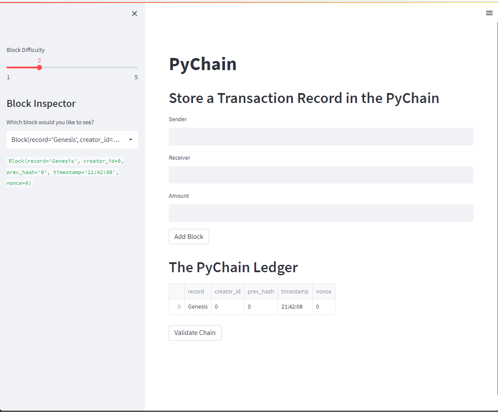
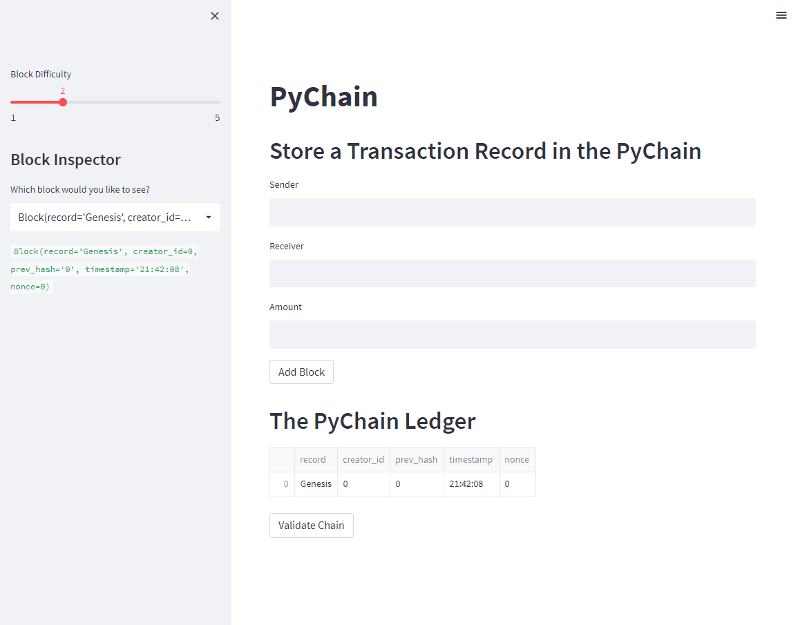
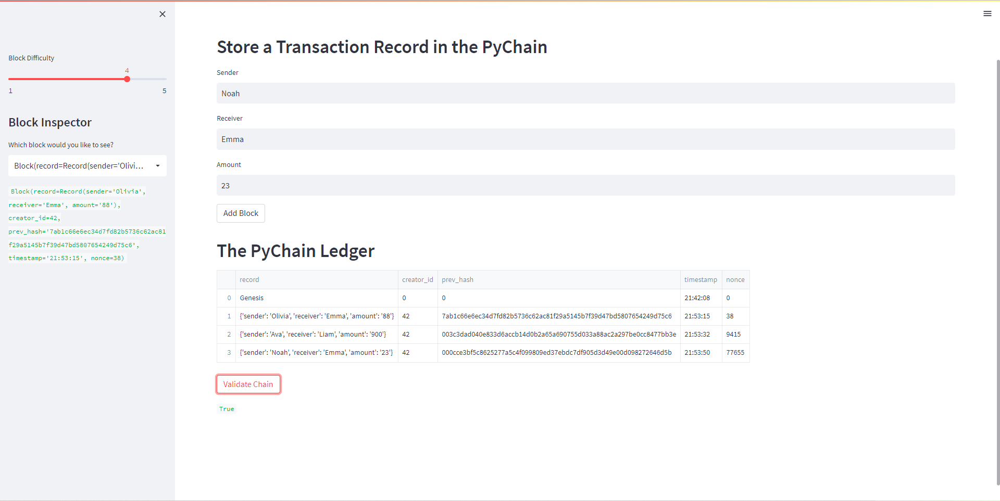

# Unit-18-PyChain-Ledger

## Purpose 
    1. conduct financial transactions (sucha as transferring money between senders and receivers) and;
    2. to verify the integrity of the data in the ledger
---
## Blockchain-based Ledger System 

### Home Page - ***input information*** 
> 1. Sender name

> 2. Receiver name

> 3. Transfer amount

> 4. Block difficulty

### Demo

> Add multiple transations and verification 

### Review

> 1. Select Block on ***sidebar*** to inspect details informatioin

> 2.  Overview all blocks from 'The Pychain Ledger'

> 3. Validate each hash value of **previous** block matching with **current** block's `prev_hash` attribute.

